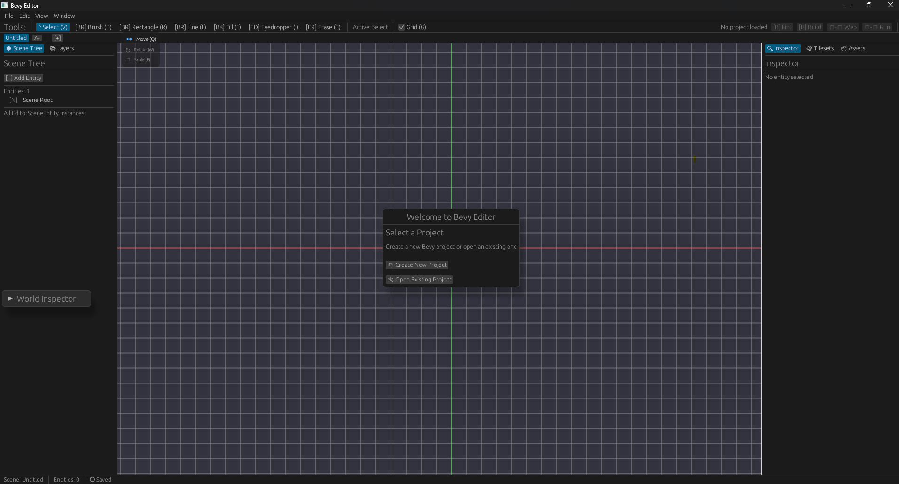
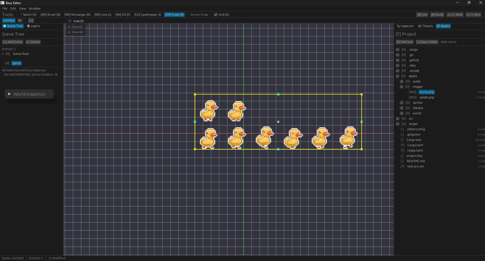
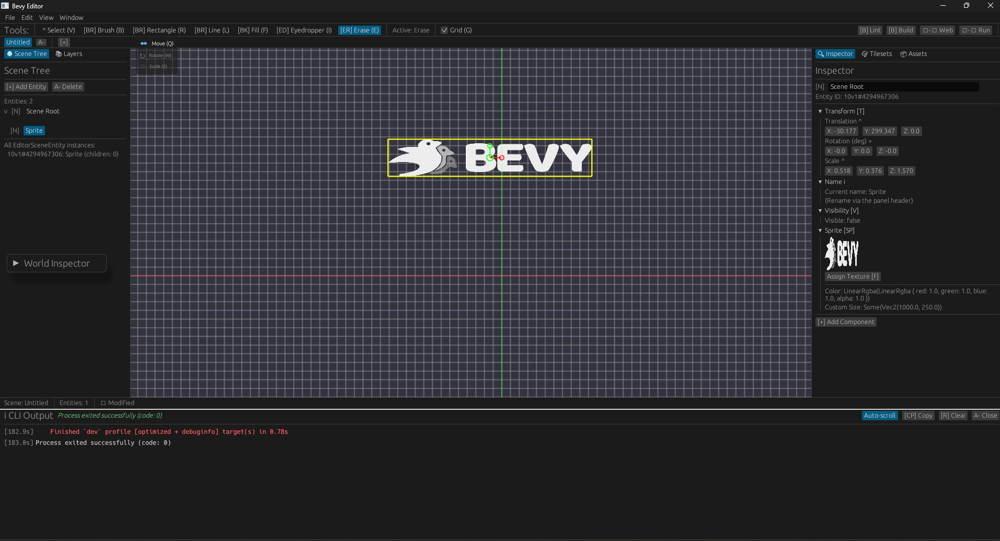
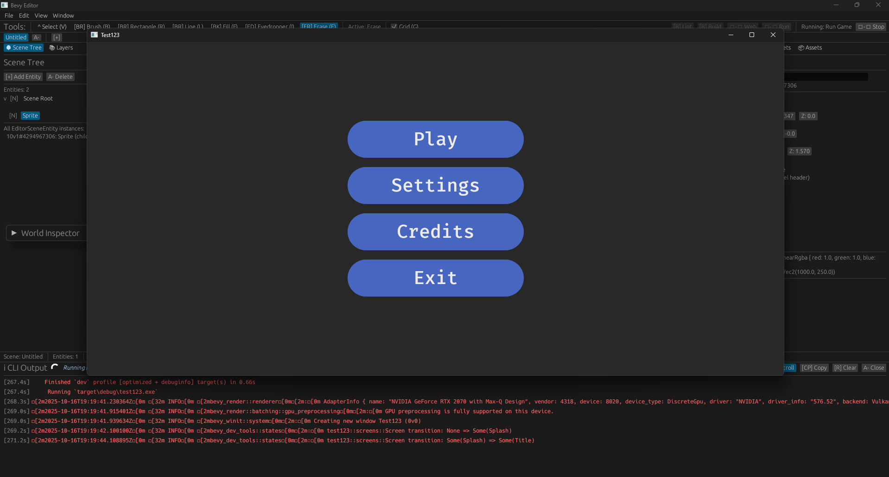

# User Guide

How to use the Bevy Experimental Editor.

---

## Getting Started

Launch the editor:
```bash
cargo run -p bevy_editor
```

First time? You'll see a project picker. Click **Create Project** to make a new one, or **Open Project** to browse for an existing Bevy project.



The editor remembers your recent projects in `~/.bevy_experimental_editor/workspace.json`.

---

## The Workspace

**Viewport** (center): Interactive scene view. Click entities to select, drag gizmos to transform.

**Scene Tree** (left): Hierarchy of entities in the current scene. Right-click to add/delete entities.

**Inspector** (right): Edit components on the selected entity. Change transforms, assign textures, tweak UI properties.

**Scene Tabs** (top): Each tab is a separate scene. Switch between them freely - the editor saves your work in memory.

**Toolbar** (top): Run builds, save scenes, toggle tools.

**Panels** (bottom): Asset browser, project files, CLI output, tilemap tools.

---

## Common Tasks

### Creating a Scene

1. Click the **+** button in the scene tabs bar
2. Name your scene (e.g., "level_1")
3. Hit **Ctrl+S** to save it to disk

The scene gets saved as a `.scn.ron` file in your project's assets folder.

### Adding Entities

Right-click in the Scene Tree → **Add Entity**. Pick from:
- Empty (container for children)
- Sprite (2D image)
- Camera2D
- UI Button
- UI Text

### Moving Things Around

Select an entity in the viewport, then:
- **Q** - Move gizmo (drag arrows to reposition)
- **W** - Rotate gizmo (drag circle to rotate)
- **E** - Scale gizmo (drag boxes to resize)

Hold **middle mouse** to pan. **Mouse wheel** to zoom.

### Assigning Textures

1. Select a sprite entity
2. In the Inspector, find the **Sprite** component
3. Click **Assign Texture**
4. Pick an image from your project's `assets/` folder

Or use the **Asset Browser**: double-click any texture to apply it to the selected sprite.



### Painting Tilemaps - CURRENTLY BROKEN AFTER REFACTORING

1. Open the **Tilemap** panel (bottom)
2. Click **Load Tileset** and pick a PNG
3. Select a layer from the **Layers** panel
4. Choose a brush mode (single, rectangle, line, fill)
5. Click in the viewport to paint

The tileset grid snaps automatically. Use the inspector to adjust grid size if needed.

### Running Your Game



Click **Run** in the toolbar. The editor:
1. Builds your project with `cargo build`
2. Launches the game in a new window
3. Shows compilation output in the CLI panel

Hit **Stop** to kill the running process. You can also run web builds or linting from the same toolbar.



---

## Keyboard Shortcuts

| Key | Action |
| --- | ------ |
| Ctrl+S | Save current scene |
| Ctrl+Z / Ctrl+Shift+Z | Undo / Redo |
| Q / W / E | Move / Rotate / Scale gizmo |
| G | Toggle grid snap |
| V | Select tool |
| I | Eyedropper (pick tile or color) |
| Alt+Click | Temporary eyedropper |

---

## Tips

**Scene tabs remember unsaved changes.** Switch tabs freely - the editor snapshots your work. Hit Ctrl+S when you're ready to commit to disk.

**Project-relative paths.** When you assign a texture, the editor stores the path relative to your project root. This keeps scenes portable across machines.

**Grid snapping.** Press **G** to toggle. When enabled, entities snap to the nearest grid cell as you drag them.

**CLI panel.** If a build fails, check the CLI output for errors. The panel stays open after the process exits so you can review the log.

---

## Next Steps

- Check out [`ARCHITECTURE.md`](ARCHITECTURE.md) if you want to embed the editor in your own tools
- See [`EDITOR_ROADMAP.md`](EDITOR_ROADMAP.md) for upcoming features
- Report bugs or request features on GitHub

Happy editing!
